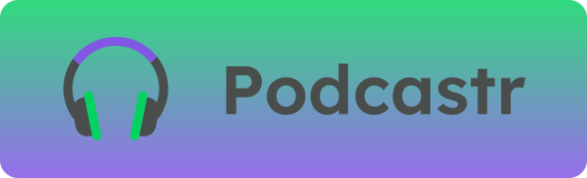
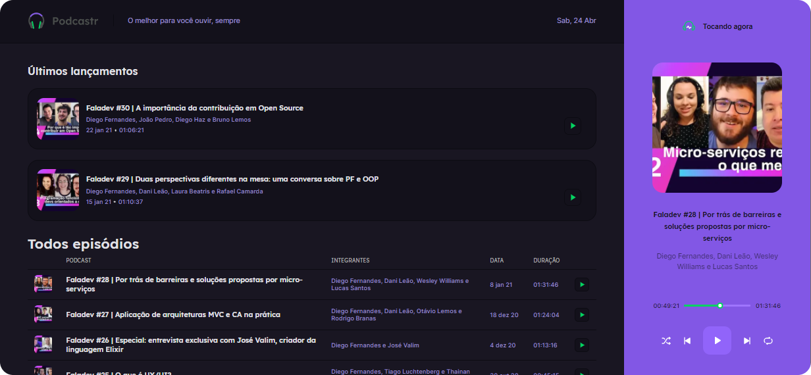

<p align="center">
  

  
  
  <a href="https://github.com/grochavieira/podcastr/commits/master">
    
  </a>
    
   
  
</p>
<h1 align="center">
    
</h1>

<h4 align="center"> 
	🚧  Aplicação em desenvolvimento! 🚧
</h4>

## 🏁 Tópicos

<p>
 👉<a href="#-sobre-o-projeto" style="text-decoration: none; "> Sobre</a> <br/>
👉<a href="#-funcionalidades" style="text-decoration: none; "> Funcionalidades</a> <br/>
👉<a href="#-layout" style="text-decoration: none"> Layout</a> <br/>
👉<a href="#-demonstracao" style="text-decoration: none"> Demonstração</a> <br/>
👉<a href="#-como-executar-o-projeto" style="text-decoration: none"> Como executar</a> <br/>
👉<a href="#-tecnologias" style="text-decoration: none"> Tecnologias</a> <br/>
👉<a href="#-autor" style="text-decoration: none"> Autor</a> <br/>
👉<a href="#user-content--licença" style="text-decoration: none"> Licença</a>

</p>

## 💻 Sobre o projeto

🎧 Projeto da NLW #05 da Rocketseat, uma aplicação para ouvir podcasts.

<!-- <a align="center" href="https://podcastr-taupe-sigma.vercel.app/">
    
</a> -->

---

<a name="-funcionalidades"></a>

## ⚙️ Funcionalidades

---

## 🎨 Layout

### Página Home

<div align="center">
    
</div>

### Página de Episódio

<div align="center">
    
</div>

---

<a name="-demonstracao"></a>

## 🕹️ Demonstração

<!-- <a align="center" href="https://www.linkedin.com/feed/update/urn:li:activity:6774407879257657344/">
    
</a> -->

---

## 🚀 Como executar o projeto

Este projeto contém apenas uma parte:

1. Frontend

### Pré-requisitos

Antes de começar, você vai precisar ter instalado em sua máquina as seguintes ferramentas:
[Git](https://git-scm.com), [Node.js](https://nodejs.org/en/), [Yarn](https://classic.yarnpkg.com/en/docs/install).
Além disto é bom ter um editor para trabalhar com o código como [VSCode](https://code.visualstudio.com/)

<!-- ### Váriaveis de Ambiente

> Veja o arquivo [.env.sample](https://github.com/grochavieira/podcastr/blob/master/web/.env.sample) -->

#### 🧭 Rodando a aplicação web (Frontend)

```bash

# Clone este repositório
$ git clone https://github.com/grochavieira/podcastr.git

# Acesse a pasta do projeto no seu terminal/cmd
$ cd podcastr

# Instale as dependências
$ yarn install

# Execute a aplicação em modo de desenvolvimento
$ yarn dev

# A aplicação será aberta na porta:3000 - acesse http://localhost:3000

```

---

## 🛠 Tecnologias

As seguintes ferramentas foram usadas na construção do projeto:

#### **Website** ([React](https://reactjs.org/) + [TypeScript](https://www.typescriptlang.org/))

- **[next.js](https://nextjs.org/)**
- **[css-Modules](https://github.com/css-modules/css-modules)**
- **[sass](https://sass-lang.com/)**
- **[date-fns](https://github.com/date-fns/date-fns)**
- **[rc-slider](https://www.npmjs.com/package/rc-slider)**

> Veja o arquivo [package.json](https://github.com/grochavieira/podcastr/blob/master/package.json)

#### **Utilitários**

- Editor: **[Visual Studio Code](https://code.visualstudio.com/)**
- Fontes: **[Lexend](https://fonts.google.com/specimen/Lexend)**, **[Inter](https://fonts.google.com/specimen/Inter)**

---

<a name="-autor"></a>

## 🦸‍♂️ **Autor**

<p>
 
 <br />
 <sub><strong>🌟 Guilherme Rocha Vieira 🌟</strong></sub>
</p>

[](https://www.linkedin.com/in/grochavieira/)

---

## 📝 Licença

Este projeto esta sobe a licença [MIT](./LICENSE).

Feito com :satisfied: por Guilherme Rocha Vieira 👋🏽 [Entre em contato!](https://www.linkedin.com/in/grochavieira/)

---
